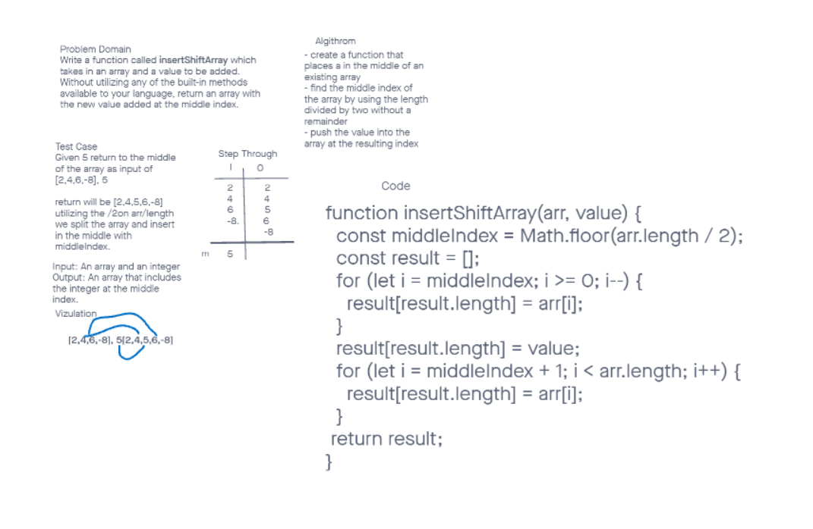

# Array Insert Shift
We needed to insert an integer into the middle of an array.

## Whiteboard Process

## Approach & Efficiency
We collaborated to move through the whiteboard more efficently. 

## Solution
<!-- Show how to run your code, and examples of it in action -->

## Credit
- Hayden Cooper (partner)
with assistance from:
- Daniel Frey (TA)
- Keelan (TA)