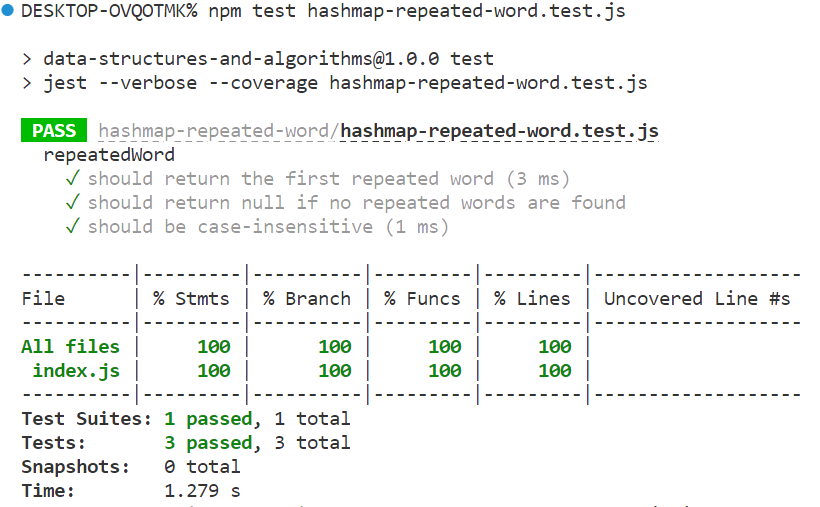

# Code Challenge 31: Hashmap Repeated Word
Write a function called repeated word that finds the first word to occur more than once in a string
Arguments: string
Return: string

## Whiteboard Process

## Testing

## Collaboration
ChatGpt helped with the testing.