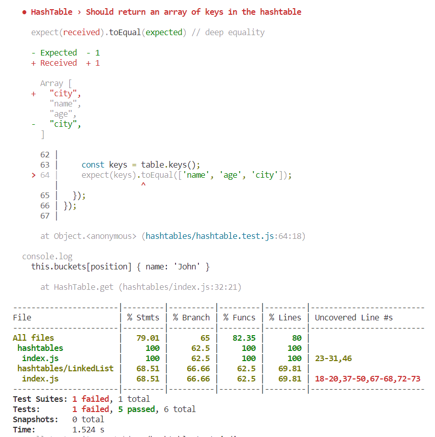

# Code Challenge 30: Hashtables
Implement a Hashtable Class with the following methods:
- set
- get
- has
- keys
- hash

## Whiteboard Process
This was an implementation challenge and did not require a whiteboard.

## Testing
Implimented six tests and almost got them all passing, wasted a decent amount of time to try to get the last one but since this was a resubmit for one point, I'm going to let that last test go. It had something to do with duplicity among the keys, but I couldn't figure out where it was getting passed. 

