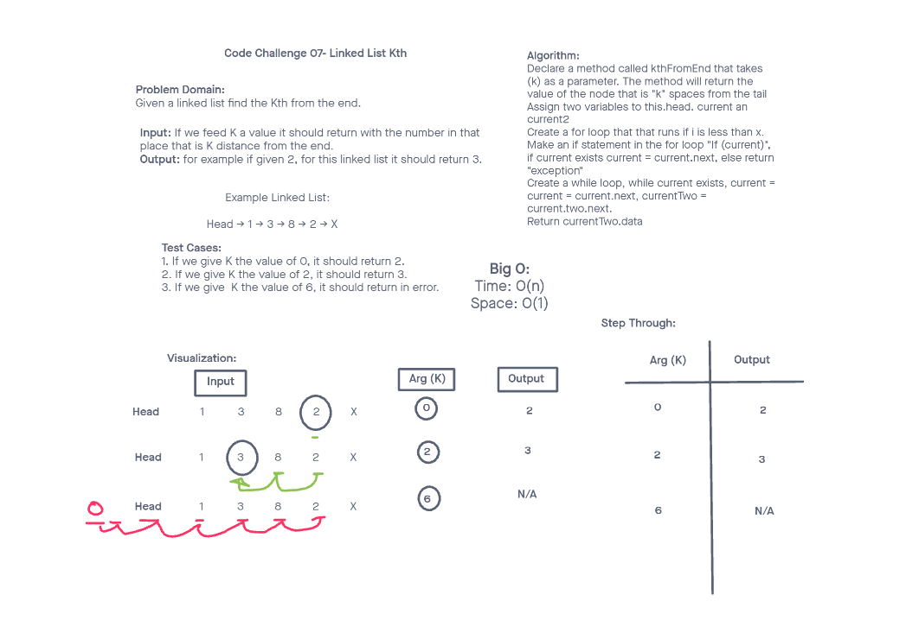

# Challenge Title
Linked List Kth

## Whiteboard Process

## Approach & Efficiency
By using two different pointers, we tried to make the whole process more efficient. 

## Collaborators
Emmanuel Gonzales was my partner for this challenge.

## Solution
