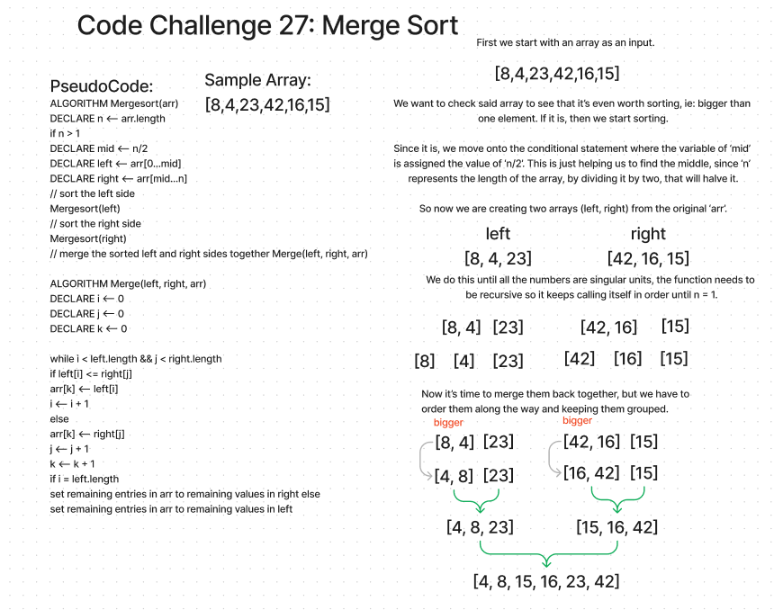
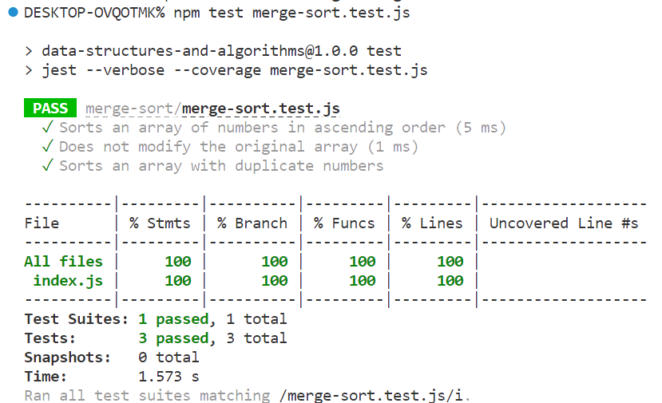

# Code Challenge: Merge Sort
Based on the pseudocode provided create a blog explaining the algorithm and then use the provided array to step through the process. 

## Whiteboard Process

## Solution

## Collaborations
This was a solo challenege, but I did use ChatGPT to help with the tests and watched a few youTube videos to understand what all was going on.  

[Learn merge sort in 13 minutes](https://youtu.be/3j0SWDX4AtU)
[Merge sort algorithm](https://youtu.be/TzeBrDU-JaY)
[Algorithms: merge sort](https://youtu.be/KF2j-9iSf4Q)
[Merge sort- coding algorithms explained](https://youtu.be/1sdEchFsL0Y)

