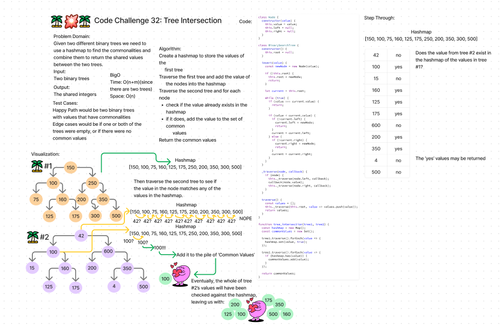
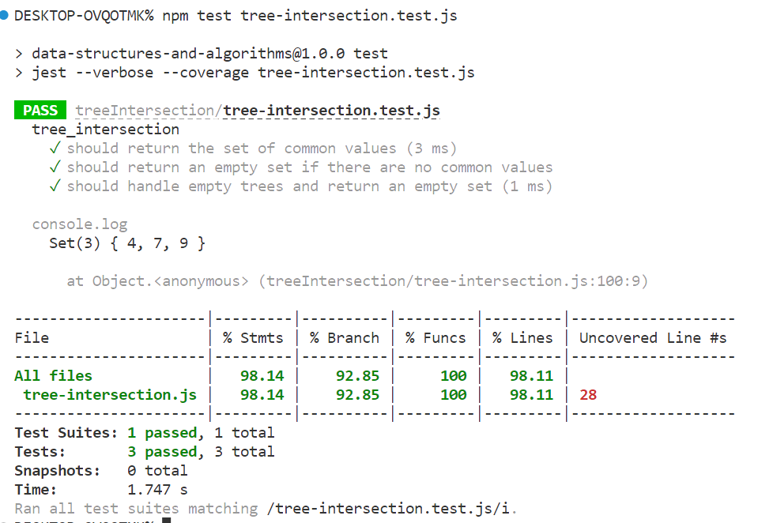

# Code Challenge 32: Tree Intersection
Find common values in 2 binary trees using a hashmap.

## Whiteboard Process

## Testing

## Collaborators 
I did this code challange solo since both my laptop and I were under the weather. Although, as usual the ChatGPT was super helpful with the testing. 